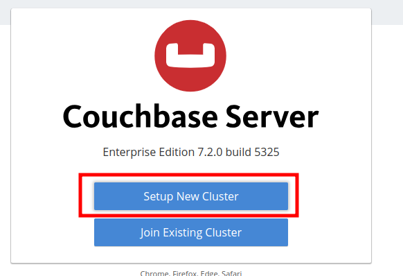
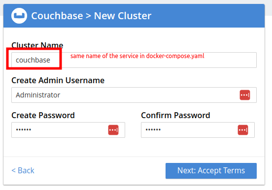
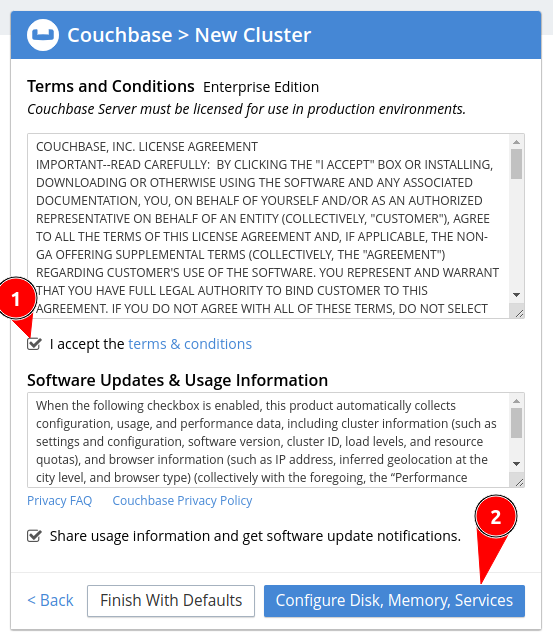
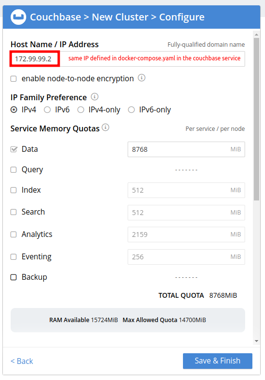
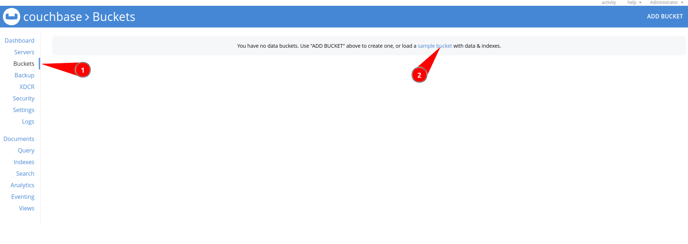
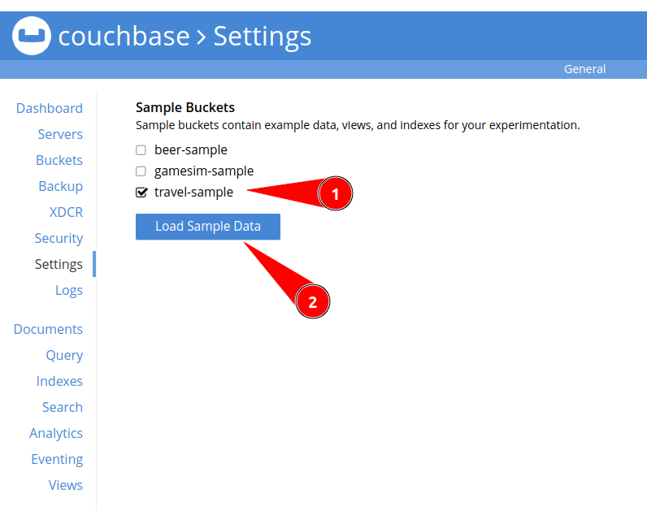

# POC-GOLANG-COUCHBASE

Solving the trouble about docker network connection between services using `Couchbase` and `Go SDK`

First of all, I got this issue trying to connect a golang container application to a couchbase container in the same network.

The first thing that happens was `CONNECTION_TIMOUT` in context, but, exposing the ports in the running machine and then running the golang code outside the container the connection works fine.

With this context, I read the docs:

- `Managing connections settings` <https://docs.couchbase.com/go-sdk/current/howtos/managing-connections.html#connection-strings>
- `Constrained network environments` <https://docs.couchbase.com/ruby-sdk/current/ref/client-settings.html#constrained-network-environments>
- `Install Couchbase Server Using Docker` <https://docs.couchbase.com/server/current/install/getting-started-docker.html>

Then the solution begins to make sense to me...

First, to set up the cluster you `MUST_KNOW` its network IP to properly config the connector to the bucket, and to know exactly the IP, in `docker-compose.yaml` like below:

```yaml
version: "3.8"
services:
  # golang app container (you don't need to place a fixed IP here!)
  app:
    image: golang:latest
    working_dir: /app
    volumes:
      - .:/app
      - go:/go
    command: go run main.go

  # couchbase service container
  couchbase:
    image: couchbase:latest
    volumes:
      - couchbase:/opt/couchbase/var
    networks:
      default:
          ipv4_address: "172.99.99.2" # defining a fixed IP
    # you need to expose those ports to access UI and config your server
    ports:
      - 8091-8096:8091-8096
      - 11210-11211:11210-11211

# config the default network of this context
networks:
  default:
    ipam:
      driver: default
      config:
        - subnet: 172.99.99.0/24 # defining a network cidr

# just some volumes to store data as default
volumes:
  go: {}
  couchbase: {}
```

So, first up the `couchbase` service using the command `docker compose up -d couchbase`, access <http://localhost:8091> then follow the steps below:

1. \

1. use password `123456` \

1. \

1. \

1. \

1. \


So far so good, but now it's time to do some code in `go` :P

This code below is used from source <https://github.com/couchbase/docs-sdk-go/blob/5bdfb75c1c04e8b0819021d14705adcd5e4c1291/modules/hello-world/examples/startusing.go> and is used to test purposes only!

[Take a Look at this file](./main.go) in lines 16,17. and then, create a container using the command `docker compose run --rm app bash` and follow the steps below:

```sh
go mod tidy
go run main.go
```

Try to uncomment line 17 and comment line 16 then run the application again! ... And it works :tada:

```log
docker compose run --rm app bash
Creating gocouchbase_app_run ... done
root@c94f1419800b:/app# go mod tidy
go: downloading github.com/couchbase/gocb/v2 v2.6.3
go: downloading github.com/couchbase/gocbcore/v10 v10.2.3
go: downloading github.com/google/uuid v1.3.0
go: downloading github.com/golang/snappy v0.0.4
go: downloading github.com/couchbaselabs/gocaves/client v0.0.0-20230404095311-05e3ba4f0259
go: downloading github.com/stretchr/testify v1.8.2
go: downloading gopkg.in/yaml.v3 v3.0.1
go: downloading github.com/davecgh/go-spew v1.1.1
go: downloading github.com/pmezard/go-difflib v1.0.0
go: downloading github.com/stretchr/objx v0.5.0
root@c94f1419800b:/app# go run main.go
User: {Jade jade@test-email.com [Swimming Rowing]}
2023/08/16 00:44:38 service not available | {"statement":"SELECT * FROM airline WHERE id=10","client_context_id":"1c96f5e3-b7ca-481c-862f-5942efed7bdd"}
exit status 1
root@c94f1419800b:/app# 
```
